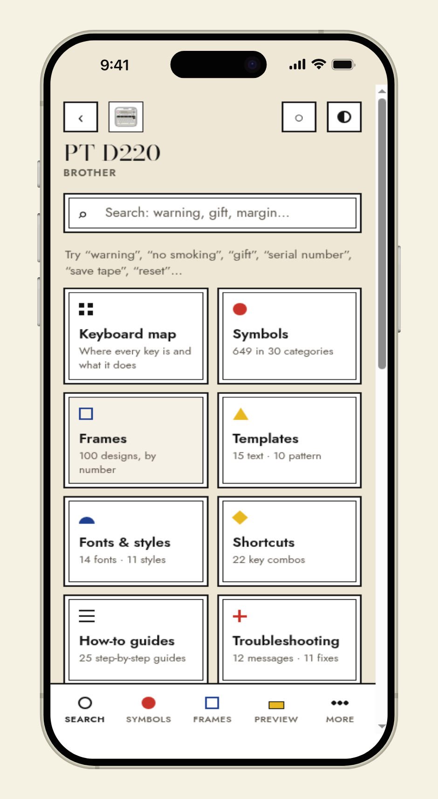
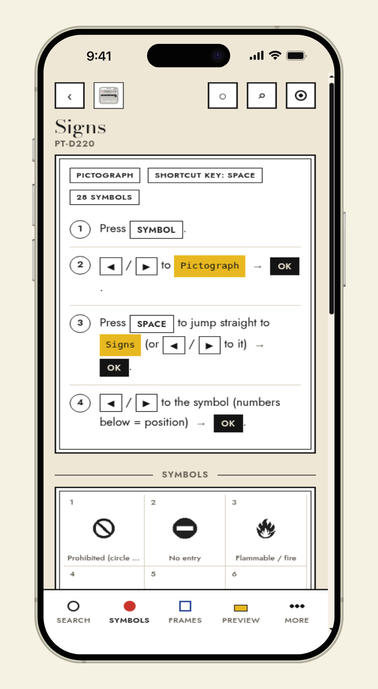
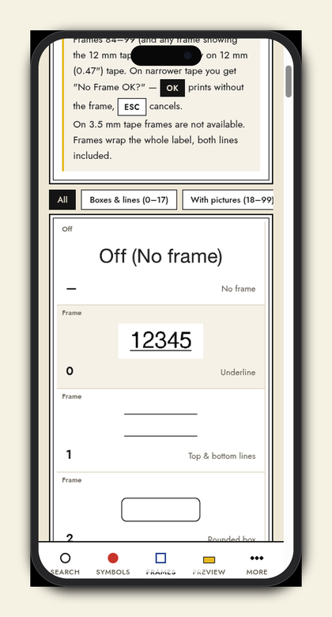
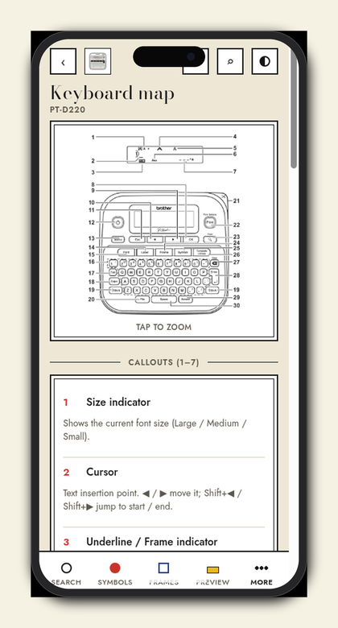

# Labelarium

Every symbol, frame, template and shortcut of your label maker: searchable, with pictures, offline.
A zero-dependency progressive web app (plain HTML/CSS/JS, no build step).

## Screenshots

Phone UI (iPhone frame). Hard-refresh after install if you already had an older build cached.

<p align="center">
  
  
  
  
</p>
<p align="center">
  
  
  
</p>

| Shot | What it shows |
| --- | --- |
| Home | Brand chips and square tiles for every supported maker |
| Device home | Section tiles for one model (search, symbols, frames, preview, …) |
| Symbols | Pictograph category with on-device steps |
| Frames | Numbered frames with sheet crops |
| Keyboard | Annotated keyboard map, tap to zoom |
| Preview | Live tape + key-press recipe fields |
| DYMO LM160 | Same shell on a non-Brother pack |

## Label makers

Ten packs today:

- **Brother** PT-D220, PT-D210, PT-D610BT, PT-P710BT (CUBE Plus)
- **DYMO** LabelManager 160, LabelManager 280
- **NIIMBOT** D110
- **Brady** M210, M211
- **Phomemo** M110 (support pages; no official PDF catalog)

Deepest catalog coverage is still on the two everyday Brother handhelds:

- **PT-D220**: 30 symbol categories (371 pictograph glyphs, each with a name, keywords and its position
  on the device), 99 frames + underline, 25 templates, 14 fonts, 11 styles.
- **PT-D210**: 27 symbol categories (311 pictograph glyphs, each with a name, keywords, a per-item crop
  from the official D210 guide, and its position on the device), 99 frame slots on the sheet (01 is Off,
  02 is underline), 27 templates (17 text + 10 pattern), 14 fonts, 10 styles (no I+Solid). Counted from
  the D210 insertion sheet: 621 symbols (310 Basic including boxed/circled 1-99, plus 311 pictographs).
  Brother lists 617.

Both of those include 22 shortcuts, how-to guides, every LCD error message, and a label previewer that
writes the recipe of key presses for the design you built. Other packs follow the same shell with
whatever the official guide (or support pages) documents for that model.

## Design language

Neoclassical × Bauhaus, in the "Tabs & rail" structure with "Plates" content (see `concepts/v2.html`,
variation E + C): warm paper ground, white plates with a double rule, Bodoni Moda only for page titles,
Jost for everything you read (16 px body, 12 px labels), and eleven distinct geometric marks, one per
section. Phones get a bottom tab bar (Search, Symbols, Frames, Preview, More); from 900 px a fixed left
rail. Warm opium-tinted paper only — no dark theme. Fonts are bundled (SIL OFL, licences in `fonts/`), ~70 KB of woff2.
Earlier explorations: `concepts/index.html` (six styles) and `concepts/v2.html` (five variations).

## Label preview

Design a label (tape, colour, fonts, style, frame, margins, length, mirror, two lines) and get the exact
key-press recipe for the device. Steps tick off on tap. "Save this label" stores the design locally so it
can be recalled with its recipe later.

## Run it

```bash
python3 -m http.server 8321
```

Open <http://localhost:8321>. On a phone on the same Wi-Fi use `http://<your-computer-ip>:8321`.

Installing as an app (and the offline cache) requires a secure context: `localhost`, or any HTTPS host.
The whole thing is static files, so GitHub Pages / Netlify / Cloudflare Pages work as-is.
On iOS: Share → Add to Home Screen. On Android/Chrome: menu → Install app.

## Deploy

Everything is static. Push the repository to GitHub and enable Pages (root), or drop the folder on Netlify,
Cloudflare Pages or any web server. HTTPS is required for installation and the offline cache; all three
hosts provide it. No build step, no environment variables.

## Add another label maker

1. Create `devices/<brand>-<model>/device.js` exporting one object. Copy `devices/brother-pt-d220/device.js`
   as the schema reference (symbols, frames, templates, fonts, shortcuts, howto, errors, problems, tips).
   Step strings use `[Key]` for a key on the device and `{Text}` for what the LCD shows.
2. Put pictures under `devices/<brand>-<model>/img/` (symbols/`<category>-NN.png`, frames/`N.png`,
   templates/`text-NN.png` …). Only referenced files are needed.
3. Add an entry to `devices/index.json`. Done: search, favorites, offline save and the previewer pick it up.
4. Drop a flat top-view SVG at `icons/devices/<id>.svg` for the homepage tile and device chrome.

## Layout

```
index.html  app.js  style.css   app shell (hash router, search, views, previewer)
sw.js  manifest.webmanifest     PWA: precached shell, cache-first runtime, "Save offline" per device
devices/index.json              list of label makers
devices/<id>/                   device.js data + img/ assets from the official guide
icons/devices/                  homepage / rail printer SVGs
docs/screenshots/               phone product shots for this README
fonts/                          bundled Bodoni Moda + Jost (SIL OFL)
```

## Support

If Labelarium is useful, [buy me a coffee on GitHub Sponsors](https://github.com/sponsors/jatinkrmalik).

## Licence

Code is licensed under the GNU Affero General Public License v3.0. See `LICENSE`. In short: you may use,
study, change and share it, but if you run a modified version for others over a network you must offer
them the modified source under the same licence. The name and marks are separate; see `TRADEMARK.md`.
Bundled fonts are under the SIL Open Font License (`fonts/`). Device imagery under `devices/*/img` is
reproduced from each manufacturer's user guide (or support pages) for reference purposes.
