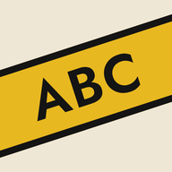
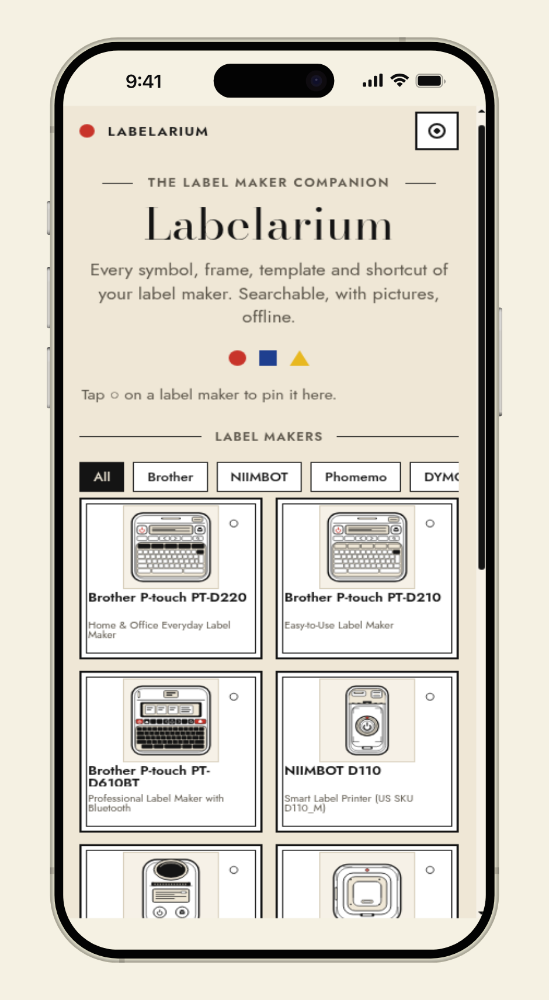
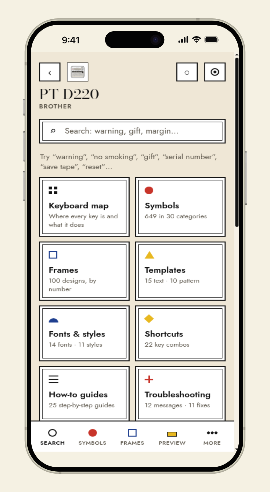
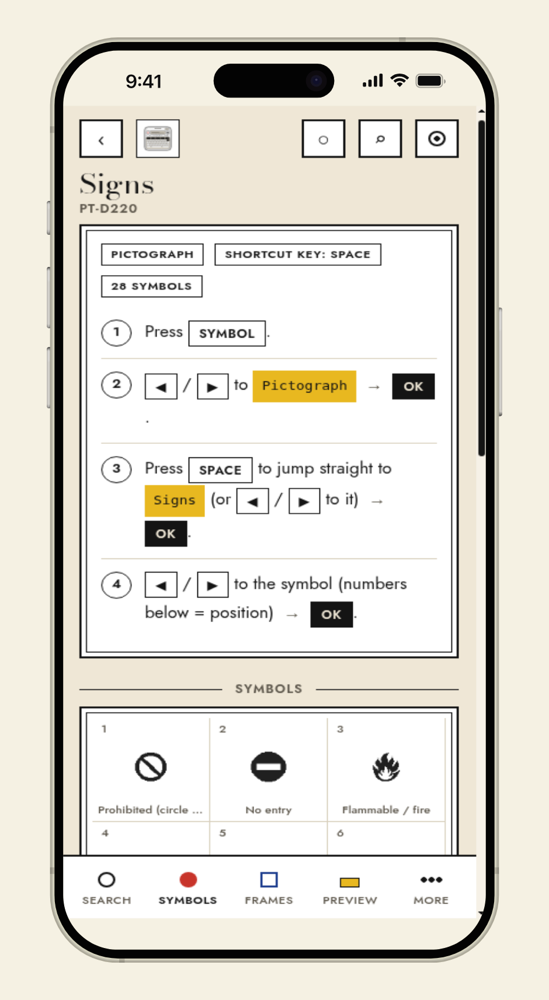
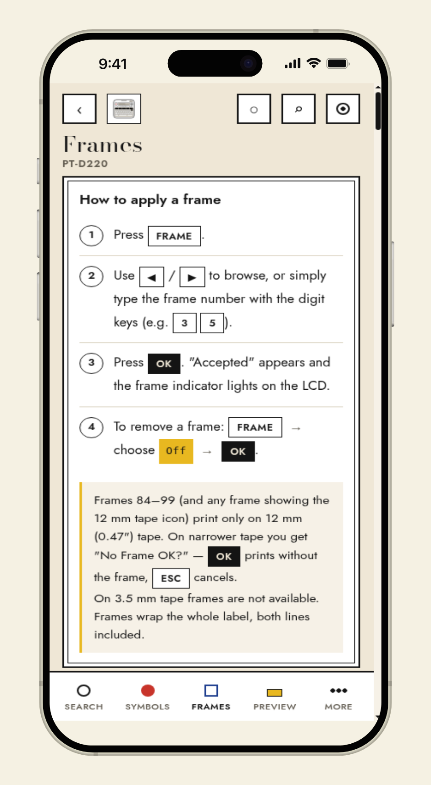
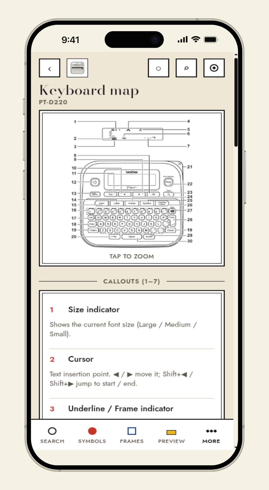
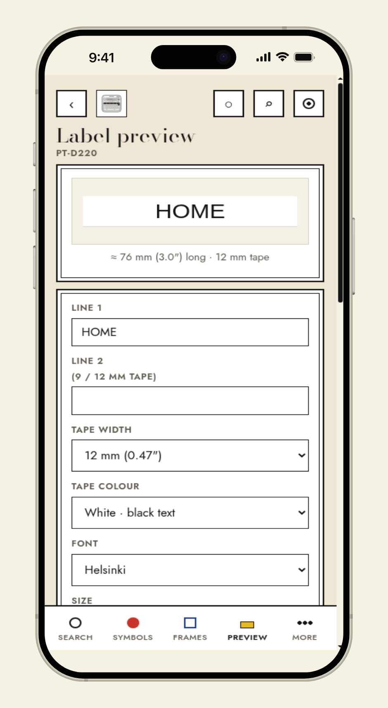
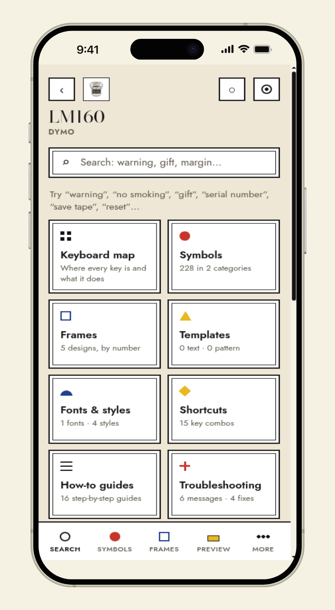

<h1>
  
  Labelarium
</h1>

[](LICENSE)
[](https://labelarium.com)
[](https://labelarium.com)
[](https://labelarium.com)

Search for the frame or symbol, see the picture, then follow the key-press recipe on the device.

Use it at **[labelarium.com](https://labelarium.com)**. Skip the buried Frame/Symbol menus and the insertion sheet. Unofficial, free, and offline once you save a pack. Deepest on the Brother PT-D220 and PT-D210. Also DYMO, NIIMBOT, Brady, Phomemo, and other Brother models.

Plain HTML/CSS/JS, zero dependencies, hosted on GitHub Pages.

## Screenshots

Phone UI (iPhone frame).

<p align="center">
  
  
  
  
</p>
<p align="center">
  
  
  
</p>

| Shot | What it shows |
| --- | --- |
| Home | Brand chips and square tiles for every supported maker |
| Device home | Section tiles for one model (search, symbols, frames, preview, …) |
| Symbols | Pictograph category with on-device steps |
| Frames | Numbered frames with sheet crops |
| Keyboard | Annotated keyboard map, tap to zoom |
| Preview | Live tape + key-press recipe fields |
| DYMO LM160 | Same shell on a non-Brother pack |

## Label makers

Ten models. Search, pictures, and the key path work the same on each. The two everyday Brother handhelds are the ones where you can actually put the paper sheet away.

- **Brother** PT-D220, PT-D210, PT-D610BT, PT-P710BT (CUBE Plus)
- **DYMO** LabelManager 160, LabelManager 280
- **NIIMBOT** D110
- **Brady** M210, M211
- **Phomemo** M110 (support pages; no official PDF catalog)

PT-D220 and PT-D210 are indexed well enough to search instead of paging the device. The counts are how much of the sheet is in the index:

- **PT-D220**: 30 symbol categories (371 pictograph glyphs, each with a name, keywords and its position
  on the device), 99 frames + underline, 25 templates, 14 fonts, 11 styles.
- **PT-D210**: 27 symbol categories (311 pictograph glyphs, each with a name, keywords, a per-item crop
  from the official D210 guide, and its position on the device), 99 frame slots on the sheet (01 is Off,
  02 is underline), 27 templates (17 text + 10 pattern), 14 fonts, 10 styles (no I+Solid). Counted from
  the D210 insertion sheet: 621 symbols (310 Basic including boxed/circled 1-99, plus 311 pictographs).
  Brother lists 617.

Both of those include 22 shortcuts, how-to guides, every LCD error message, and a label previewer that
writes the recipe of key presses for the design you built. Other packs follow the same shell with
whatever the official guide (or support pages) documents for that model.

## Label preview

Design a label (tape, colour, fonts, style, frame, margins, length, mirror, two lines) and get the exact
key-press recipe for the device. Steps tick off on tap. "Save this label" stores the design locally so it
can be recalled with its recipe later.

## Install

On iOS: Share → Add to Home Screen. On Android/Chrome: menu → Install app.

The site is static files under `site/`: no build step, no environment variables. A fork can stay on GitHub Pages, or
drop the `site/` folder on Netlify, Cloudflare Pages, or any web server. HTTPS is required for installation and
the offline cache.

Routes are ordinary paths (`/d/brother-pt-d220/symbols`), not `#/` hashes. GitHub Pages serves `site/404.html`
(a copy of the app shell) for those paths; keep it in sync with `site/index.html`.

## Run it locally

Serve `site/` as the web root. There is no build step.

```bash
python3 -m http.server -d site 8080
```

Open <http://localhost:8080>. On a phone on the same Wi-Fi use `http://<your-computer-ip>:8080`.

Installing as an app (and the offline cache) requires a secure context: `localhost`, or any HTTPS host.
Python's built-in server does not rewrite deep paths: after the first load, in-app links still work, but a
refresh on a deep path 404s unless the host rewrites to the shell.

## Layout

```
site/                           deployable web root (GitHub Pages artifact)
  index.html  app.js  style.css app shell (History API router, search, views, previewer)
  404.html                      GitHub Pages SPA fallback (keep in sync with index.html)
  robots.txt  sitemap.xml       crawlers; path URLs on labelarium.com
  sw.js  manifest.webmanifest   PWA: precached shell, cache-first runtime, "Save offline" per device
  CNAME                         labelarium.com
  devices/index.json            list of label makers
  devices/<id>/                 device.js data + img/ assets from the official guide
  icons/og.png                  Open Graph image (1200×630)
  icons/devices/                homepage / rail printer SVGs
  docs/screenshots/             phone product shots for this README
  fonts/                        bundled Bodoni Moda + Jost (SIL OFL)
docs/og/                        Open Graph source material (not in the Pages artifact)
```

## CI and GitHub Pages

Pull requests and pushes to `main` run [`.github/workflows/ci.yml`](.github/workflows/ci.yml). That check
confirms required files exist under `site/`, that `site/CNAME` is `labelarium.com`, and that every
device id in `site/devices/index.json` has a matching `device.js`.

Publishing to [labelarium.com](https://labelarium.com) uses [`.github/workflows/pages.yml`](.github/workflows/pages.yml),
which uploads the `site/` folder on push to `main`. Set the repository Pages source to **GitHub Actions**
(Settings → Pages → Build and deployment → Source), not a branch deploy. That is a one-time repo setting
and is not assumed to be switched yet.

## Support

If Labelarium is useful, [buy me a coffee on GitHub Sponsors](https://github.com/sponsors/jatinkrmalik).

## Community

Want a model that is not listed yet? [Request a label maker](https://github.com/jatinkrmalik/labelarium/issues/new?template=label_maker_request.yml) and I will add it.
PRs for app fixes are welcome; start with [CONTRIBUTING](CONTRIBUTING.md).
We follow a
[code of conduct](CODE_OF_CONDUCT.md). Vulnerabilities go to
[SECURITY](SECURITY.md), not a public issue. Everyday bugs and requests live in
[Issues](https://github.com/jatinkrmalik/labelarium/issues). Coffee still lives
on [Sponsors](https://github.com/sponsors/jatinkrmalik).

## Trademarks

Brother, DYMO, NIIMBOT, Brady, Phomemo, and related product names and logos belong to their
respective owners. Labelarium is unofficial and not affiliated with those companies. See
[`TRADEMARK.md`](TRADEMARK.md).

## Licence

Code is licensed under the GNU Affero General Public License v3.0. See `LICENSE`. In short: you may use,
study, change and share it, but if you run a modified version for others over a network you must offer
them the modified source under the same licence. The name and marks are separate; see `TRADEMARK.md`.
Bundled fonts are under the SIL Open Font License (`site/fonts/`). Device imagery under `site/devices/*/img` is
reproduced from each manufacturer's user guide (or support pages) for reference purposes.
